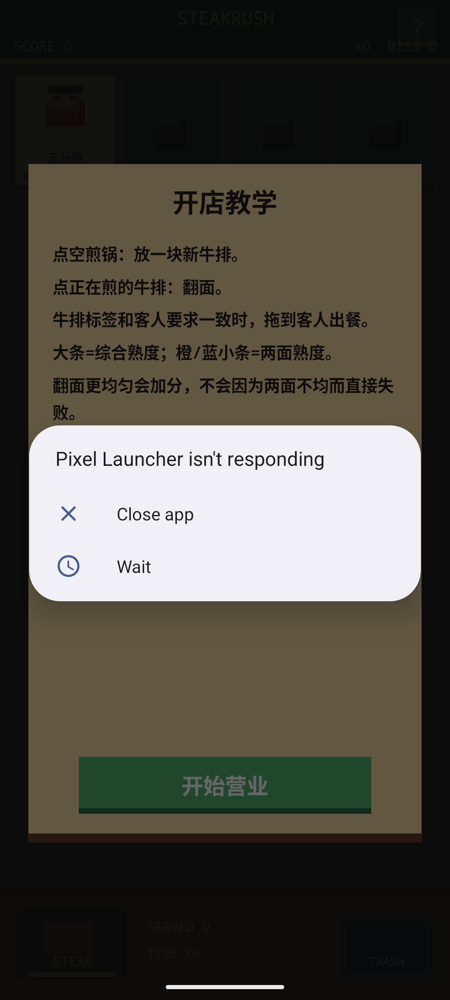
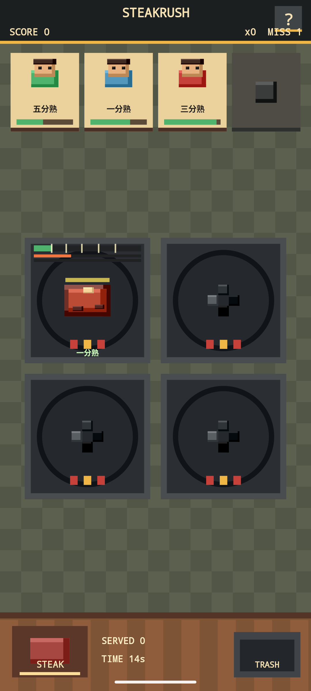
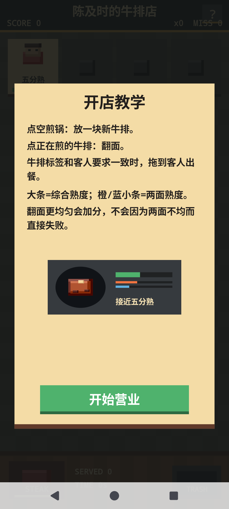

# SteakRush

[](https://github.com/AI4S-YB/SteakRush/actions/workflows/build-apk.yml)

SteakRush 是一款竖屏 Android 餐厅经营原型游戏。玩家需要同时管理多口煎锅，根据顾客要求把牛排煎到指定熟度，并在顾客耐心耗尽前完成出餐。

项目当前定位是可运行的早期原型：玩法闭环、像素风界面、教学页、暂停菜单、煎烤音效、程序化音乐、中文语音提示、自动 APK 构建都已经具备。

English summary: SteakRush is a portrait Android restaurant-management game prototype about cooking steaks to customer-requested doneness under time pressure.

## 截图

<p>
  
  
  
</p>

## 下载体验

最新自动构建的调试 APK 会发布到 GitHub Releases：

- [Latest debug APK Release](https://github.com/AI4S-YB/SteakRush/releases/tag/debug-latest)
- [直接下载 SteakRush-debug.apk](https://github.com/AI4S-YB/SteakRush/releases/download/debug-latest/SteakRush-debug.apk)

> 当前 APK 是 debug 构建，适合测试安装。正式签名 release 包还未启用。

## 玩法说明

- 顾客会提出熟度要求：一分熟、三分熟、五分熟、七分熟、全熟。
- 点击空煎锅可以放入新牛排。
- 点击正在烹饪的牛排可以翻面。
- 牛排熟度接近顾客要求时，拖动牛排到对应顾客位置完成出餐。
- 拖动牛排到垃圾桶可以丢弃，但会扣分并清空连击。
- 顾客耐心耗尽会离开，并计入 Miss。
- 连续成功出餐可以提高连击奖励。
- 暂停按钮可以冻结游戏进程，暂停期间牛排熟度、顾客耐心和生成计时都不会继续推进。

## 游戏特色

- 竖屏单手操作，适合手机快速体验。
- Canvas 自绘像素块风格，不依赖外部美术素材。
- 牛排有双面熟度：橙色代表底面，蓝色代表顶面，翻面会影响两侧熟度均衡。
- 评分考虑目标熟度、顾客剩余耐心、连击、两面均衡度和完美出餐。
- Android TextToSpeech 提供中文点单、成功和失败语音反馈。
- 背景音乐由 AudioTrack 实时生成；煎烤底噪使用 CC0 真实音效素材，并叠加程序化入锅/拿起反馈声。
- 内置教学页、暂停菜单、重新开局入口和调试构建自动发布。

## 技术实现

- 平台：Android 原生 Java
- 构建：Gradle 8.7 + Android Gradle Plugin 8.5.2
- 最低版本：Android 6.0, API 23
- 目标版本：Android 15, API 35
- 渲染：自定义 `View` + `Canvas`
- 游戏逻辑：`GameEngine`
- 视图与交互：`GameView`
- 音频与语音：`AudioManager`
- 自动构建：GitHub Actions

主要源码：

- `app/src/main/java/com/steakrush/GameEngine.java`
- `app/src/main/java/com/steakrush/GameView.java`
- `app/src/main/java/com/steakrush/AudioManager.java`
- `app/src/main/java/com/steakrush/MainActivity.java`

## 本地构建

所有本地引导依赖默认放在 `.deps/`，不会提交到仓库。

```powershell
powershell -ExecutionPolicy Bypass -File scripts\bootstrap-deps.ps1
powershell -ExecutionPolicy Bypass -File scripts\build-apk.ps1 -Clean
```

debug APK 输出位置：

```text
app/build/outputs/apk/debug/app-debug.apk
```

安装到已开启 USB 调试的 Android 手机：

```powershell
powershell -ExecutionPolicy Bypass -File scripts\install-apk.ps1
```

如果手机提示“签名不一致”或 `INSTALL_FAILED_UPDATE_INCOMPATIBLE`，说明设备上已有旧签名的 `com.steakrush`。先卸载旧包，再安装新版：

```powershell
adb uninstall com.steakrush
powershell -ExecutionPolicy Bypass -File scripts\install-apk.ps1
```

从本次固定 debug 签名后，本地和 GitHub Actions 生成的 debug APK 会使用同一证书，后续同类 debug 包可以直接覆盖安装。

启动本地 Android 模拟器测试：

```powershell
powershell -ExecutionPolicy Bypass -File scripts\start-emulator-test.ps1
```

如果模拟器窗口太大，可以指定缩放比例：

```powershell
powershell -ExecutionPolicy Bypass -File scripts\start-emulator-test.ps1 -Scale 0.32
```

## 自动构建

仓库包含 GitHub Actions 工作流：

- 每次推送到 `main` 会构建 debug APK。
- Pull Request 会执行构建验证并上传临时 artifact。
- `main` 构建成功后会创建或更新 `debug-latest` 预发布版，并上传 `SteakRush-debug.apk`。
- 也可以在 Actions 页面手动触发构建。

工作流文件：

```text
.github/workflows/build-apk.yml
```

## 开发路线

已完成：

- 核心烹饪与出餐循环
- 顾客耐心、熟度目标、评分、连击和 Miss
- 像素风游戏界面
- 教学页
- 暂停和重新开局
- 真实煎烤底噪、程序化交互音效与中文 TTS
- Debug APK 自动构建和 Release 上传

计划补充：

- 正式签名 release APK 或 AAB
- 更完整的结算页和关卡目标
- 设置页：音乐、语音、震动开关
- 更丰富的顾客和订单变化
- 自动化测试和更多设备尺寸验证

## License

See [LICENSE](LICENSE).
